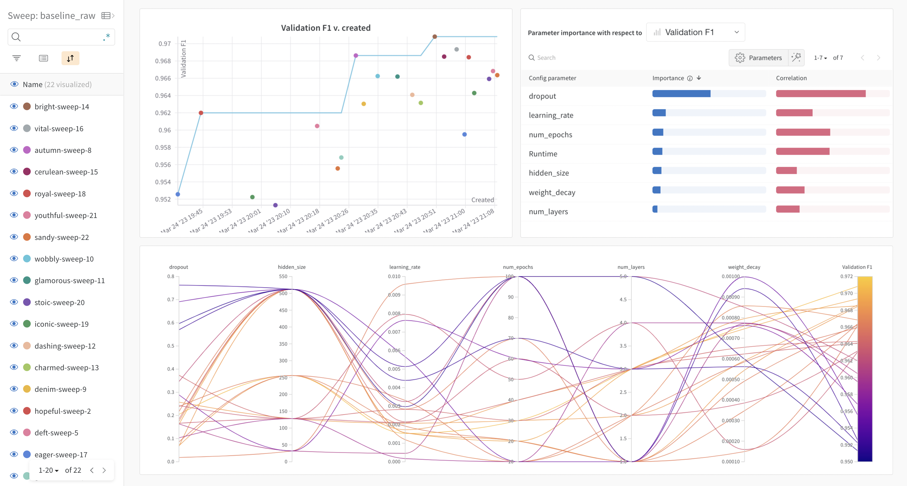

# nuwe-ds-challenge
Repository for the Nuwe's "Product manager - Data science challenge manager" position challange.

## Model benchmarking tables (showing F1 score)

The models used are:
- `Baseline`: simple MLP of variable number of layers.
- `FT Transform`: an adaptation from [this paper](https://arxiv.org/abs/2106.11959v2), consisting of an adoption of the Transformer architecture for tabular data. My version does not include embedidngs for categorical variables, since they are transformed to one-hot encodings during pre-processing.

The datasets used are the ones resulting from the [data exploration notebook](./scripts/data_exploration.ipynb). One can check such notebook for further details on the dataset generation process:
- `raw`: the original train dataset.
- `cleaned`: the original dataset, but removing variables that had no correlation to the target __Attrition_Flag__ variable.
- `balanced`: a variation of the __cleaned__ dataset, where the number of positive and negative __Attrition_Flag__ was more balanced. The data balancing was produced via sampling (upsampling and downsampling).

### models - datasets (trained on BCE Loss)

Binary Cross Entropy Loss is the standard loss for binary classification problems.

| Model Name          | raw     | cleaned | balanced |
|---------------------|---------|---------|----------|
| Baseline            | 0.8950 | 0.8857 | 0.7186 |
| Baseline fine-tuned | 0.9063 | ...  | 0.7206 |
| FT Transformer      | 0.9009 | 0.8886 | 0.7211 |
| FT Transformer fine-tuned | **0.9137** | ... | ... |

### models - datasets (trained on [Smoothed F1 Score Loss](https://www.kaggle.com/code/rejpalcz/best-loss-function-for-f1-score-metric/notebook))

Smoothed F1 Score Loss is a continuous variation of F1 score that allows probabilistic predicitions. It is not commonly used as it might not have ideal mathematical properties, but theoretically it is more aligned to the evaluation F1 score than BCE.

| Model Name          | raw    | cleaned | balanced |
|---------------------|--------|---------|----------|
| Baseline            | 0.8579 | 0.8568 | 0.7372 |
| Baseline fine-tuned | 0.8646 | ...  | ... |
| FT Transformer      | 0.8036 | 0.8055 | 0.7473 |

The best model from the ones trained is the finetuned version of the FT Tansformer using BCE Loss on the raw dataset. Its test predictions can be accessed [here](./predictions.json).

* The baseline models were initilised using a random configuration.
* All fine-tuning was made using Weights & Biases (W&B) sweeps.

## Future work

I believe that adding an embedding layer to the FT Transformer model would yield a higher testing F1 score, since the model will be able to capture and contextualize better the data, compared to a simple one-hot vector. Therefore, as future work adding this extra embedidng layer should be tested.

Additionally, all the fine-tuned models should be filled out in the model comparison benchmark. I had problems version compatibility problems of Pytorch and CUDA, and I could not use GPU for training. As the fine-tuning consumes a lot of resources (several training are performed), I could not fine-tune all the models.

## Repository organisation

This repository is organised in three folders:
- `data`: Holds both the datasets produced during the data exploration, and the test predictions in json format.
- `model`: Contains the models in TorchScript format, the training evaluation plots, and W&B runs information.
- `scripts`: Includes all the python files, as well as the data exploration notebook and the W&B sweeps configuration.

In the root directory there is `env.yml`, with the Conda environment used (for Linux OS).